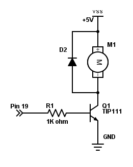

# CPU_fan
Code to implement a CPU cooler for the Raspberry Pi 3

Project
-------
[Raspberry Pi fan cooler - Hackster.io](https://www.hackster.io/iscapla/raspberry-pi-fan-cooler-86f3f9)

Installation
------------
No extra installed packages are needed to run this program.

Possible configuration
----------------------
Create a config.ini file in this direction. You can change it in the code.
File: 

	/home/pi/Programs/config.ini

Content:
	
	[Fan]
	waitTime_sec: 5
	avg_list_num: 4
	pin: 19
	minTMP: 44
	maxTMP: 48
	[Others]
	verbose: 0

Electronic Schema
-----------------

More info
---------
Send me an email: iscapla@live.com
